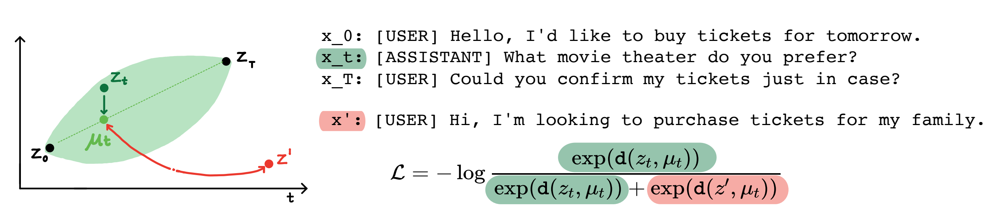

# Language modeling via stochastic processes


## 论文介绍

现代语言模型能够生成高质量的短文本。然而，在生成较长文本时，它们经常表现得离题或不连贯。这些问题源于仅考虑下一个标记的语言建模目标。最近在自监督学习方面的研究表明，通过对比学习，模型可以学习到良好的潜在表示，这对于区分性任务非常有效。该论文分析了对比表示在生成性任务（如长文本生成）中的应用。

## 下载安装

1. 运行脚本setup.sh
2. 确定在conda的虚拟环境中: `conda activate language_modeling_via_stochastic_processes`
3. 安装解码器: 

```
cd decoder # enter the decoder repo
pip install -e . # Installing transformers locally; I modified their GPT2 module to take in our learned embeddings for decoding.
```
## 如何运行

#### 编码器

1. `cd encoder/code; source init_env.sh`；
2. 找到 `encoder/code/scripts/run_ou.py`, 将变量名 `ckpt_dir` 设置为检查点文件夹的名字；
3. 运行脚本`encoder/code/scripts/train_encoders.sh`。

#### 编码器实验

1.  `cd encoder/code; source init_env.sh`；
2. 在`encoder/code/scripts/run_discourse.py`和`encoder/code/src/systems/discourse_system.py`文件中, 将正确路径设置为数据目录和存储目录；
3. 运行脚本`encoder/code/scripts/discourse.sh`.。

#### 解码器

1.  `decoder/examples/pytorch/language-modeling/`；
2. 训练解码器的脚本可在 `decoder/examples/pytorch/language-modeling/train_encoders.sh`找到， 确保修改了 `path2repo` 变量；
3. 在 `run_time_clm.py`中更改数据目录。

#### 生成文本

1. 生成文本时进入 `decoder/transformers/examples/pytorch/text-generation/`文件夹；
2. 运行生成文本并测量每个部分长度不匹配的脚本`decoder/transformers/examples/pytorch/text-generation/toy_wikisection_generation.sh`；
3. 运行生成长文本的脚本 `decoder/transformers/examples/pytorch/text-generation/long_generation.sh`。

